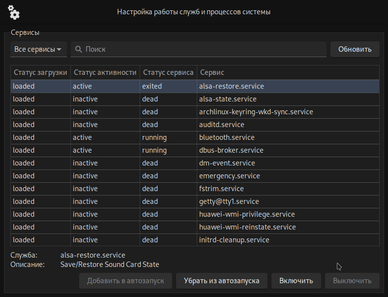

# ubilinux_services

> :warning: Тестовый режим

> :exclamation: Для корректной работы запуск должен осуществляться от рут-пользователя либо в системе должен присутствовать `polkit`

## Ссылки

- [репа](https://gitea.ublinux.ru/Artwork_Applications/design-ubl-settings-apps/src/branch/master/ubl-settings-services)

## TODO

- [ ] Проследить за выделением памяти и её высвобождением (см. [ниже](#valgrind-отчет))
- [ ] Более точно прописанные условия включения/выключения кнопок разрешающих старт/стоп/автозапуск
- [ ] Выбор списка сервисов через комбо-бокс
- [ ] Перевод
- [ ] Решить/обойти спам `gtk_list_store_set_valist: assertion 'iter_is_valid (iter, list_store)' failed` в консоли

## valgrind отчет
